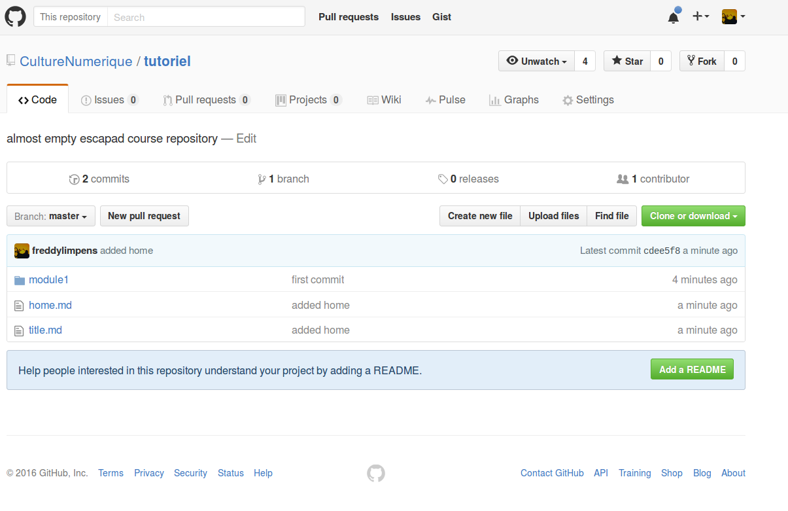

Tutoriel de prise en main de la chaine éditoriale Esc@pad
=========================================================

Ce chapitre propose un parcours type permettant de prendre en main les outils et technologies qui composent la chaine éditoriale Esc@Pad. L'objectif à l'issu de ce tutoriel est d'être capable d'éditer un contenu pédagogique en autonomie en utilisant Esc@pad. Les outils et notions abordées sont:
- les rudiments de `git` et de la plateforme GitHub (création d'un compte, fork, commits)
- la syntaxe markdown pour la rédaction du contenu
- la syntaxe GIFT pour la création de quiz
- l'usage de l'application Escapad pour la génération des supports multi-format (web, IMS/Moodle, EDX)


# Création d'un compte GitHub et fork

Création du compte

- remplissez et validez le formulaire localisé à [https://github.com/join](https://github.com/join)
- à l'étape suivant "Choose your plan", laissez l'option "Unlimited public repositories for free", cliquez sur "Continue"
- l'étape suivante "Tailor your experience" peut être sautée ("Skip this step")
- à l'écran final "Learn Git and GitHub without any code!" qui vous invite à lire le guide (hautement conseillé pour la suite néanmoins), ne faites rien, et passez à la suite de ce tutoriel.

"Fork" du dépôt-exemple

- loguez-vous sur github.com avec votre nouveau `monlogingithub` (login d'exemple utilisé pour la suite, NDR.) et allez sur [https://github.com/CultureNumerique/course_template](https://github.com/CultureNumerique/course_template)
- cliquez sur le bouton "Fork" en haut à droite
- vous arrivez normalement sur la page du dépôt "forké" `https://github.com/monlogingithub/course_template`


Notez à ce stade l'arborescence type d'un dépôt de cours qui contient 1 moodule "module1" (explorez les dossiers en cliquant sur leur nom):

```
- module1/
    - example_module1.md
    - media/
        - 3.vue_cours_avec_video.png
        - vue_web_cours.png
- README.md
- home.md
- logo.png
- title.md    
```
